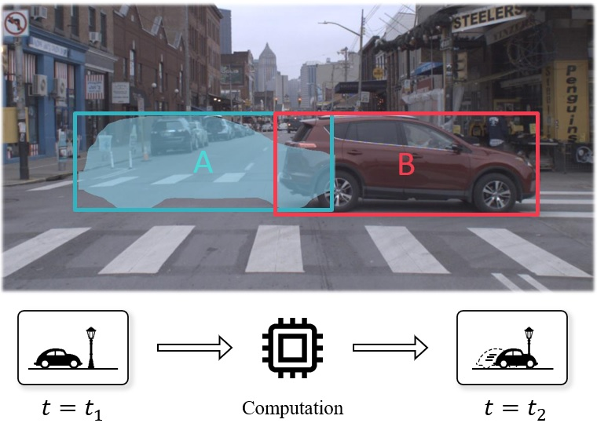
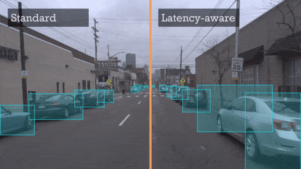

# sAP &mdash; Code for Towards Streaming Perception

<p align="center"></p>

 ECCV Best Paper Honorable Mention Award

This repo contains code for our ECCV 2020 [**paper**](https://arxiv.org/abs/2005.10420) (Towards Streaming Perception). sAP stands for streaming Average Precision.

The dataset used in this project (Argoverse-HD) can be found on the [**project page**](http://www.cs.cmu.edu/~mengtial/proj/streaming/).


## Contents

- Offline detection
- Streaming (real-time online) detection
- Streaming tracking \& forecasting
- Simulated streaming detection, tracking, \& forecasting
- Simulated streaming detection, tracking, \& forecasting with infinite GPUs 
- Meta-detector Streamer
- Streaming evaluation
- Single-frame schedule simulator
- Helper functions for visualization


<p align="center"></p>

## Getting started

1. Follow the instructions [here](doc/data_setup.md) to download and set up the dataset.
1. Follow the instructions [here](doc/code_setup.md) to install the dependencies.
1. Check out the examples to run various tasks in `exp/*`. The documentation for these tasks can be found [here](doc/tasks.md).


## Citation
If you use the code or the data for your research, please cite the paper:

```
@article{Li2020StreamingP,
  title={Towards Streaming Perception},
  author={Li, Mengtian and Wang, Yuxiong and Ramanan, Deva},
  journal={ECCV},
  year={2020}
}
```

## Acknowledgement
We would like to thank the [mmdetection](https://github.com/open-mmlab/mmdetection) team for implementing so many different detectors in a single awesome repo with a unified interface! This greatly reduced our efforts to evaluate different detectors under our streaming setting.
