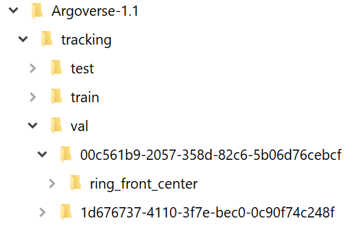
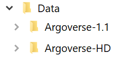

# Data Setup

## Argoverse-HD

- Download the dataset from the [project page](https://www.cs.cmu.edu/~mengtial/proj/streaming/)
- Organize the images from Argoverse into the following structure:

The hash strings represent different video sequences in Argoverse, and `ring_front_center` is one of the sensors for that sequence. Argoverse-HD annotations correspond to images from this sensor. Information from other sensors (other ring cameras or LIDAR) is not used, but our framework can be also extended to these modalities or to a multi-modality setting. 

- Unzip Argoverse-HD into the same folder as Argoverse:

## Testing on a folder of images

- Prepare a folder of images of the same size (e.g., extracted from a video)
- Use `dbcode/db_from_img_folder.py` to create a dataset meta file.
- Replace the image and annotation paths for Argoverse-HD with that for this newly created dataset in the scripts you plan to run.
