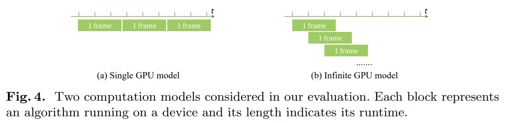
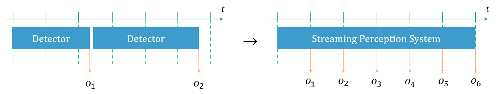
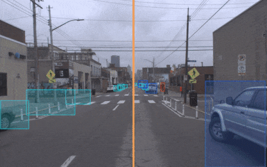
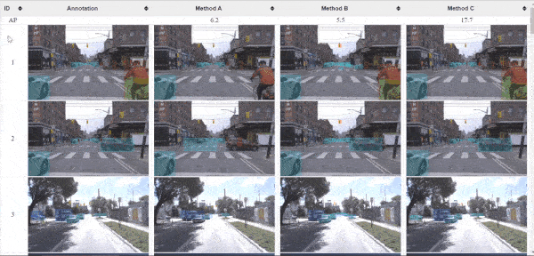

# Tasks
This doc describes tasks supported by this repo. Note that some concepts might require reading the paper or watching the talk on the [project page](http://www.cs.cmu.edu/~mengtial/proj/streaming/) to understand.

## Offline Detection
This is the standard task of running a detector on a dataset, and can be used as a sanity check to see if the data and code are correctly set up. The code outputs the detection for each frame and optionally visualizes them if provided with a visualization folder (`--vis-dir`). By default, the code also evaluates the output using `COCOeval` (our Argoverse-HD is provided in COCO format and thus it works with COCO evaluation tools). 

Code: `exp/offline_det.sh`, `det/det_offline.py`

## Streaming Detection 

In this task, the detector processes image frames from a sensor stream in a real-time online fashion. Frames may be skipped if the detector fails to catch up (as our analysis suggests: <em>it's OK to skip frames!</em>). The sensor stream is simulated by playing back videos (or extracted image frames from videos) in real-time. Before the real-time playback, all frames in the video are loaded to system memory so that disk I/O does not introduce any latency. The output of streaming detection is timestamped output.

Code: `exp/sim_streaming_det.sh`, `det/rt_det.py`

## Streaming Evaluation 

Streaming evaluation takes input timestamped detections and associates that with the corresponding image frames (time-based alignment) and then evaluates the prediction based on this correspondence. Optionally, it visualizes the detection results.

Code: `exp/sim_streaming_det.sh`, `det/streaming_eval.py`

## Creating Runtime Profiles
We need runtime distributions to simulate streaming detection (explained in the next section) and an easy way to create such a runtime profile (a collection of runtime distributions of all independent modules, e.g., detection, tracking, and forecasting) is extracting runtime samples from the previous experiment runs (forming an empirical distribution). Also, this code assumes all runtime profiles are stored in a runtime zoo (analogous to a model zoo). After you have run streaming detection at least once, the runtime samples will be collected automatically and you can add them to the runtime zoo using `util/add_to_runtime_zoo.py`.

Code: `exp/extract_runtime.sh`, `util/add_to_runtime_zoo.py`

## Simulated Streaming Detection

This task achieves the same goal as streaming detection except that both the detection output and the runtime can be simulated. There are two levels of simulation. The first level only simulates runtime. In this case, the code does not measure the runtime of algorithms but draws a sample from the provided runtime distribution (see the previous section for runtime distributions). The second level simulates both the runtime and the detection results. In this case, in addition to providing runtime distributions, you also need to provide per-frame detection results on the entire dataset. The simulator will fetch the corresponding result based on the sampled runtime. The output format is the same as streaming detection. Note that runtimes can be scaled during simulation using argument `--perf-factor` (performance factor, e.g., 1.2 means 20% faster). Also, providing argument `--dynamic-schedule` enables our dynamic scheduling policy (shrinking-tail).

By default, the code assumes a single GPU computation model, while code with `_inf` suffix assumes an infinite GPU computation model.

Code: `exp/sim_streaming_det.sh`, `det/srt_det.py`, `exp/sim_streaming_det_inf.sh`, `det/srt_det_inf.py`

## Tracking & Forecasting
For tracking, we use the IoU-based bounding box association and for forecasting, we use asynchronous Kalman Filter with a linear transition model. Since both are lightweight and have very small runtimes, we first implement their streaming version in a post-processing fashion, i.e., after a (simulated) streaming detection run, the code post-process the timestamped detection output and assume both tracking and forecasting finish instantaneously. Such a zero-runtime assumption simplifies the code structure and allows for fast modular development. The next section describes an implementation without this zero-runtime assumption.

Code: `exp/forecast.sh`, `forecast/pps_forecast_kf.py`

## Meta-Detector Streamer

Streamer is an added layer of scheduling and forecasting on top of a given detector. As shown above, it converts a detector with any runtime to a streaming perception system that has an arbitrarily fixed output rate. The scheduling and forecasting are done in separate CPU threads (multiprocessing for Python) and their runtimes, depending on the algorithm complexity, also impact the final streaming accuracy. The current implementation assumes that the detector follows mmdetection's interface. If you want to add other detectors, you can convert it to mmdetection's interface by wrapping up the detector's code in two functions: (1) `init_detector`: initializes model and loads the weights; (2) `inference_detector`: preprocesses the image and runs the detector on the image.

Code: `exp/streamer.sh`, `forecast/streamer.py`

## Visualization

There are several components of visualization serving different purposes.

### Detection Debug Visualization

This component visualizes raw detector output without thresholding and the visualization includes class names and confidence scores. This component is embedded in most of the tasks as the default visualization method, which can be activated by specifying a visualization output folder (`--vis-dir`).

Code: `det/det_offline.py`, `det/streaming_eval.py`, `det/pps_forecast_kf.py`

### Detection Thresholded Visualization

This component visualizes detector output (bounding boxes and optionally masks) without any labels. Each box or mask is overlayed with a color representing the class. This component is implemented as a standalone script in `vis/vis_det_th.py` and should be called after you have an offline or streaming detection run. In addition, this can be used to visualize annotations by providing the `--gt` flag.

Code: `exp/vis_det_th.sh`, `exp/vis_annot.sh`, `vis/vis_det_th.py`

### Contrastive Visualization

This component is designed to contrast two different settings, and it composes input from two sequences (folders of frames) to form a single sequence with a bar separating the two. The composition can be either vertical (default) or horizontal (enabled by `--horizontal` flag) and the separator can have an optional animation that switches between the individual views and the contrastive view (provide the `--split-animation` argument). The position of the separator can also be adjusted through the `--split-pos` argument, which specifies a relative position over either the width or height of the image (default to 0.5).

Code: `exp/vis_contrast.sh`, `vis/vis_contrast.py`

### Making Videos

The above components render each frame and to make a video, you need `vis/make_videos.py` and `vis/make_videos_numbered.py`. The two differ in the input naming conventions. Fortunately, for most use cases, you don't need to call these scripts yourself, since it's already integrated with the above components &mdash; they either accept a flag called `--make-video` or output a command at the end starting with `python vis/make_videos` (and you can directly copy, paste and run it!). Note that these commands will make videos for all sequences in the provided path.

**Additional Dependency Required!** The code uses `ffmpeg` under the hood for making videos. Therefore, you need to install `ffmpeg` under a path location and **with a H.264 encoder** (Anaconda3 does include ffmpeg binary but it does not contain any H.264 encoder, and you will probably get an error like : `Unknown encoder 'libx264'`)!

Code: `vis/make_videos.py`, `vis/make_videos_numbered.py`

### Web Display

To obtain a global view of the annotation or solution quality, we need a more organized display than a bunch of images and videos separated in different folders. For this purpose, we adopt solutions from [HTML4Vision](https://github.com/mtli/HTML4Vision), which conveniently organizes visualization for different examples in the dataset in a web page, and provides an HTTP server for serving the webpages on a remote machine. Here, we provide two displays &mdash; grid and table. The grid display (`vis/html_all_seq.py`) is used to show all sequences in (a split of) the dataset. Each sequence has a clickable thumbnail tiled in a grid, and the corresponding video will pop up when clicked. The table display (`vis/html_sampled_img.py`) is used to qualitatively compare different methods (see the figure above). It has each method (including the ground truth) as each column and each sampled image as a row. After generating the webpage, you can refer to [HTML4Vision's doc](https://github.com/mtli/HTML4Vision) for how to serve the webpage on a remote machine.

Code: `vis/make_videos.py`, `vis/make_videos_numbered.py`

## Schedule Simulator

This module simulates the effects of different schedule policies on overcoming temporal quantization. The formal definition and analysis of the problem can be found in Appendix B.1 of the [paper](https://arxiv.org/abs/2005.10420). Currently, the code assumes constant runtime, but it is straightforward to extend it to stochastic runtime.

